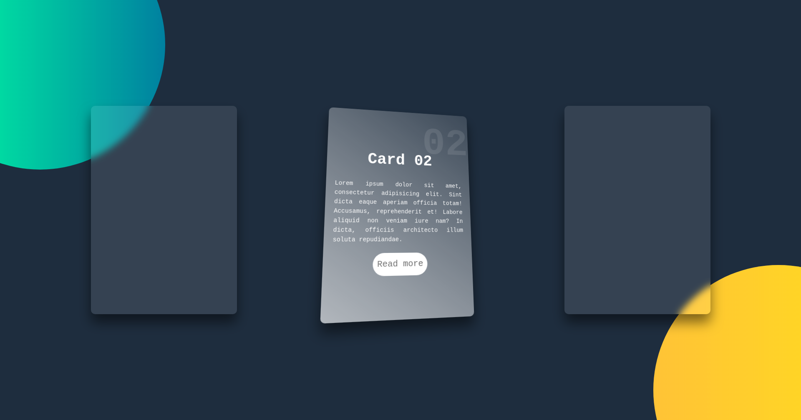
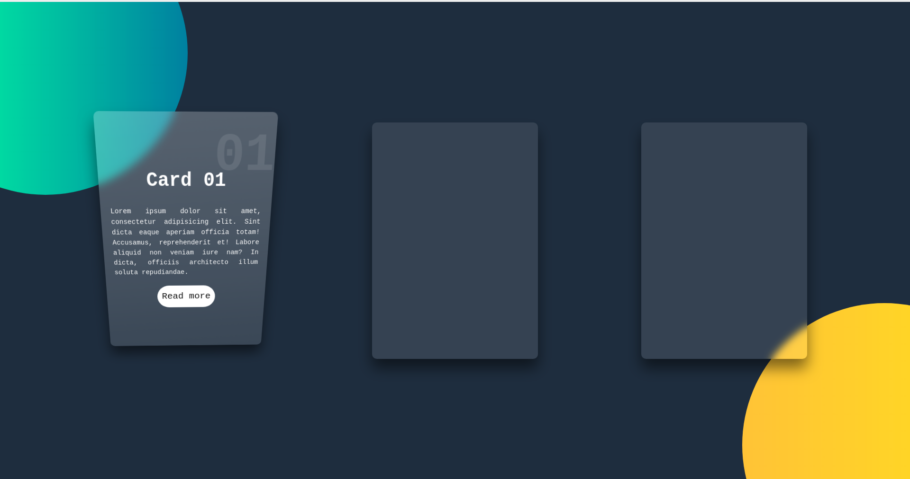

# Glassmorphism-project

```
A new glass like UI design style cards with some tilt effect.

```

## Library used

```
vanila-tilt

```

## Installation via github:

1. Clone the github project.
2. `cd into the folder`
3. Run `npm install`

## Development mode

```
npm start
```

Go to `localhost` to view the project.

## Project screenshots



